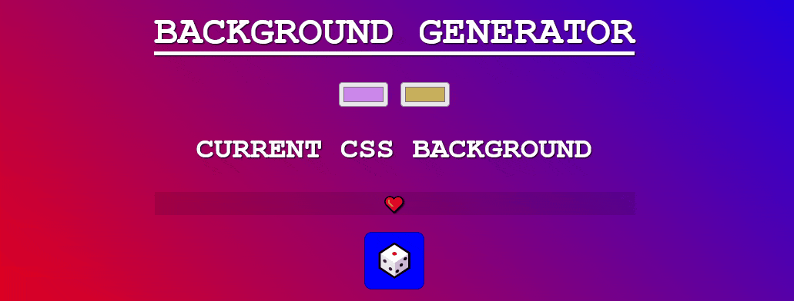

# Background generator :rainbow:

Each click on the :game_die: generates a [random](https://developer.mozilla.org/en-US/docs/Web/JavaScript/Reference/Global_Objects/Math/random) gradient and gives the formula to apply it in CSS.

